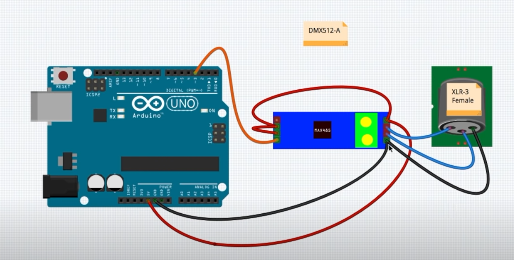

# Info

# HQ-Power VDPLP64SL: LED PAR64 - 180 LEDS VAN 10mm – Velleman

- https://www.velleman.eu/products/view?id=386160

## Kenmerken
- RGB PAR64-spot
- zeer compact design
- RGB-kleurenmenging
- ingebouwde programma's via master-slave- of muzieksturing
- DMX-sturing: DMX-sturing via 3 (RGB) of 7 kanalen (RGB, macro, stroboscoop)
- dubbele beugel: geschikt voor gebruik als vloerspot

## Specificaties
- voeding: 230 VAC 50 Hz
- verbruik: 38 W
- aantal LEDs: 180 st. (60x rood, 60x groen, 60x blauw)
- afmetingen: 250 x 280 x 65 mm
- stralingshoek: 25°
- gewicht: 1.5 kg

## PCB Serial
- CH-180P-LED.PCB (JZ) 3030002037

# Adding D1 with WLED to MAX485 output DMX
## Wiring scheme
https://github.com/robertoostenveld/arduino/tree/master/esp8266_artnet_dmx512
- connect 5V and GND from the power supply to Vcc and GND of the MAX485 module
- connect 5V and GND from the power supply to the 5V and GND of the Wemos D1 mini
- connect pin DE (data enable) of the MAX485 module to 3.3V (using 3.3V TTL)
- connect pin RE (receive enable) of the MAX485 module to GND
- connect pin D4/TX1 of the Wemos D1 mini to the DI (data in) pin of the MAX485 module (using 3.3V TTL)
- connect pin A of the MAX485 module to XLR 3
- connect pin B of the MAX485 module to XLR 2
- connect GND to XLR 1

## software setup
https://github.com/Aircoookie/WLED/wiki/DMX-Output  
For the DMX feature to work, you'll need to compile WLED from source. It's not a big deal, you can do it! Here is the Quick Start guide. There you'll find the section "i want to modify WLED".

make sure, you can compile the latest version of WLED without any issues. Then continue.

Once that works, in wled00/wled.h you need to change the line //#define WLED_ENABLE_DMX to #define WLED_ENABLE_DMX Yes, you just remove the //, which enables the line and therefore DMX support.

change either the DMX output pin (sendPin in src/dependencies/ESPDMX.cpp) or the LED output pin (LEDPIN in NpbWrapper.h) to something other than 2. If both are set to the same setting, you might experience slight flickering on your DMX output.

Once you successfully uploaded the sketch to your board, you'll find a new entry "DMX Output" in your settings menu.

Grab the manual for your lamp and maybe some snacks, look up the dmx channels and set everything up accordingly.
